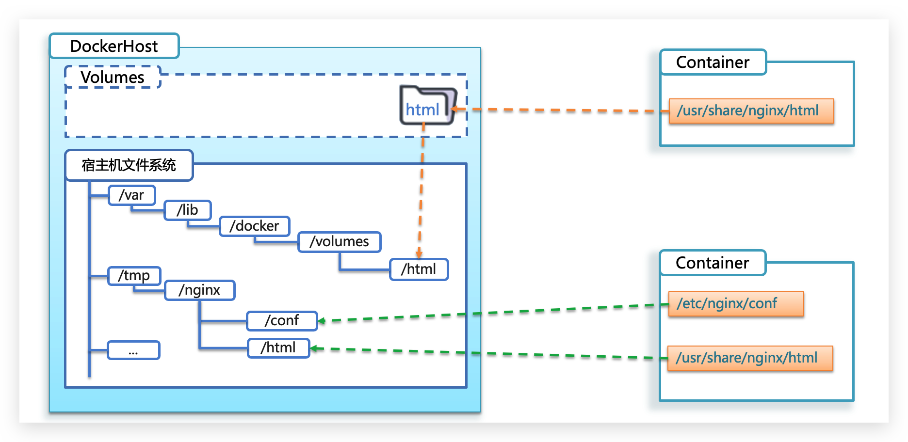

# 初识 `Docker`

## 什么是 `Docker`

微服务虽然具备各种各样的优势，但服务的拆分通用给部署带来了很大的麻烦。
- 分布式系统中，依赖的组件非常多，不同组件之间部署时往往会产生一些冲突
- 在数百上千台服务中重复部署，环境不一定一致，会遇到各种问题

大型项目组件较多，运行环境也较为复杂，部署时会碰到一些问题:
- 依赖关系复杂，容易出现兼容性问题
- 开发、测试、生产环境有差异

例如一个项目中，部署时需要依赖于 `node.js`、`Redis`、`RabbitMQ`、`MySQL` 等，这些服务部署时所需要的函数库、依赖项各不相同，甚至会有冲突。给部署带来了极大的困难。

### `Docker` 解决依赖兼容问题

`Docker` 为了解决依赖的兼容问题的，采用了两个手段:
- 将应用的 `Libs`（函数库）、`Deps`（依赖）、配置与应用一起打包
- 将每个应用放到一个隔离**容器**去运行，避免互相干扰


这样打包好的应用包中，既包含应用本身，也保护应用所需要的 `Libs`、`Deps`，无需再操作系统上安装这些，自然就不存在不同应用之间的兼容问题了。

### `Docker` 解决操作系统环境差异

要解决不同操作系统环境差异问题，必须先了解操作系统结构。以一个 `Ubuntu` 操作系统为例，结构如下:


结构包括:
- 计算机硬件: 例如 `CPU`、内存、磁盘等
- 系统内核: 所有 `Linux` 发行版的内核都是 `Linux`，例如 `CentOS`、`Ubuntu`、`Fedora` 等。内核可以与计算机硬件交互，对外提供**内核指令**，用于操作计算机硬件
- 系统应用: 操作系统本身提供的应用、函数库。这些函数库是对内核指令的封装，使用更加方便

应用与计算机交互的流程如下:
- 应用调用操作系统应用（函数库），实现各种功能
- 系统函数库是对内核指令集的封装，会调用内核指令
- 内核指令操作计算机硬件

`Ubuntu` 和 `CentOS` 都是基于 `Linux` 内核，无非是系统应用不同，提供的函数库有差异:


此时，如果将一个 `Ubuntu` 版本的 `MySQL` 应用安装到 `CentOS` 系统，`MySQL` 在调用 `Ubuntu` 函数库时，会发现找不到或者不匹配，就会报错了:


- `Docker` 将用户程序与所需要调用的系统函数库一起打包
- `Docker` 运行到不同操作系统时，直接基于打包的函数库，借助于操作系统的 `Linux` 内核来运行


### 小结

`Docker` 如何解决大型项目依赖关系复杂，不同组件依赖的兼容性问题？
- `Docker` 允许开发中将应用、依赖、函数库、配置一起**打包**，形成可移植镜像
- `Docker` 应用运行在容器中，使用沙箱机制，相互**隔离**

`Docker` 如何解决开发、测试、生产环境有差异的问题？
- `Docker` 镜像中包含完整运行环境，包括系统函数库，仅依赖系统的 `Linux` 内核，因此可以在任意 `Linux` 操作系统上运行

`Docker` 是一个快速交付应用、运行应用的技术，具备下列优势:
- 可以将程序及其依赖、运行环境一起打包为一个镜像，可以迁移到任意 `Linux` 操作系统
- 运行时利用沙箱机制形成隔离容器，各个应用互不干扰
- 启动、移除都可以通过一行命令完成，方便快捷

## `Docker` 和虚拟机的区别

`Docker` 可以让一个应用在任何操作系统中非常方便的运行。虚拟机也能在一个操作系统中，运行另外一个操作系统，保护系统中的任何应用。

两者有什么差异呢？

**虚拟机**（`virtual machine`）是在操作系统中**模拟**硬件设备，然后运行另一个操作系统，比如在 `Windows` 系统里面运行 `Ubuntu` 系统，这样就可以运行任意的 `Ubuntu` 应用了。

**Docker**仅仅是封装函数库，并没有模拟完整的操作系统:


|特性|`Docker`|虚拟机|
|-|-|-|
|性能|接近原生|性能较差|
|硬盘占用|一般为 `MB`|一般为 `GB`|
|启动|秒级|分钟级|

### 小结

- `Docker` 是一个系统进程。虚拟机是在操作系统中的操作系统
- `Docker` 体积小、启动速度快、性能好。虚拟机体积大、启动速度慢、性能一般


## `Docker` 架构

### 镜像和容器

`Docker` 中有几个重要的概念:

**镜像（Image）**: `Docker` 将应用程序及其所需的依赖、函数库、环境、配置等文件打包在一起，称为镜像。

**容器（Container）**: 镜像中的应用程序运行后形成的进程就是**容器**，只是 `Docker` 会给容器进程做隔离，对外不可见。

一切应用最终都是代码组成，都是硬盘中的一个个的字节形成的**文件**。只有运行时，才会加载到内存，形成进程。

**镜像**，就是把一个应用在硬盘上的文件、及其运行环境、部分系统函数库文件一起打包形成的文件包。这个文件包是只读的。

**容器**呢，就是将这些文件中编写的程序、函数加载到内存中允许，形成进程，只不过要隔离起来。因此一个镜像可以启动多次，形成多个容器进程。


### `DockerHub`

开源应用程序非常多，打包这些应用往往是重复的劳动。为了避免这些重复劳动，将自己打包的应用镜像，例如 `Redis`、`MySQL` 镜像放到网络上，共享使用，就像 `GitHub` 的代码共享一样。
- `DockerHub`: `DockerHub` 是一个官方的 `Docker` 镜像的托管平台。这样的平台称为 `Docker Registry`
- 国内也有类似于 `DockerHub` 的公开服务，比如 [网易云镜像服务](https://c.163yun.com/hub)、[阿里云镜像库](https://cr.console.aliyun.com/)等。

一方面可以将自己的镜像共享到 `DockerHub`，另一方面也可以从 `DockerHub` 拉取镜像:


### `Docker` 架构

`Docker` 是一个 `CS` 架构的程序，由两部分组成:

- 服务端（`server`）: `Docker` 守护进程，负责处理 `Docker` 指令，管理镜像、容器等
- 客户端（`client`）: 通过命令或 `RestAPI` 向 `Docker` 服务端发送指令。可以在本地或远程向服务端发送指令


### 小结

镜像:
- 将应用程序及其依赖、环境、配置打包在一起
容器:
- 镜像运行起来就是容器，一个镜像可以运行多个容器

`Docker` 结构:
- 服务端: 接收命令或远程请求，操作镜像或容器
- 客户端: 发送命令或者请求到 `Docker` 服务端

`DockerHub`:
- 一个镜像托管的服务器，类似的还有阿里云镜像服务，统称为 `Docker Registry`


# `Docker` 的基本操作

## 帮助启动类命令

- 启动 `Docker`: `systemctl start Docker`
- 停止 `Docker`: `systemctl stop Docker`
- 重启 `Docker`: `systemctl restart Docker`
- 查看 `Docker` 状态: `systemctl status Docker`
- 开机启动: `systemctl enable Docker`
- 查看 `Docker` 概要信息: `Docker info`
- 查看 `Docker` 总体帮助文档: `Docker --help`
- 查看 `Docker` 命令帮助文档: `Docker 具体命令 --help`

## 镜像操作


### 镜像名称

镜像的名称组成:
- 镜名称一般分两部分组成: `[repository]:[tag]`
- 在没有指定 `tag` 时，默认是 `latest`，代表最新版本的镜像
- 同一仓库源可以有多个 `tag` 版本，代表这个仓库源的不同个版本，我们使用 `[repository]:[tag]` 来定义不同的镜像。如果不指定一个镜像的版本标签，例如只使用 `ubuntu`，`docker` 将默认使用 `ubuntu:latest` 镜像


这里的 `mysql` 就是 `repository`，`5.7` 就是 `tag`，合一起就是镜像名称，代表 `5.7` 版本的 `MySQL` 镜像。

### 镜像命令

- `docker images`: 列出本地主机上的镜像
- 语法: `docker images [OPTIONS] [REPOSITORY[:TAG]]`
- `OPTIONS` 说明:
  - `-a`: 列出本地所有的镜像（含中间映像层，默认情况下，过滤掉中间映像层）
  - `-f`: 显示满足条件的镜像
  - `--no-trunc`: 显示完整的镜像信息
  - `-q`: 只显示镜像 `ID`

- `docker rmi`: 删除本地一个或多个镜像
- 语法: `docker rmi [OPTIONS] IMAGE [IMAGE...]`
- `OPTIONS` 说明:
  - `-f`: 强制删除

- `docker build`: 命令用于使用 `Dockerfile` 创建镜像
- 语法: `docker build [OPTIONS] PATH | URL | -`
- `OPTIONS` 说明:
  - `--build-arg=[]`: 设置镜像创建时的变量
  - `-f`: 指定要使用的 `Dockerfile` 路径
  - `--force-rm`: 设置镜像过程中删除中间容器

- `docker save`: 将指定镜像保存成 `tar` 归档文件
- 语法 `docker save [OPTIONS] IMAGE [IMAGE...]`
- `OPTIONS` 说明:
  - `-o`: 输出到的文件

- `docker load`: 导入使用 `docker save` 命令导出的镜像
- 语法: `docker load [OPTIONS]`
- `OPTIONS` 说明:
  - `--input`，`-i`: 指定导入的文件，代替 STDIN
  - `--quiet`，`-q`: 精简输出信息

- `docker search`: 从 `DockerHub` 查找镜像
- 语法: `docker search [OPTIONS] TERM`
- `OPTIONS` 说明:
  - `--automated`: 只列出 `automated build` 类型的镜像
  - `--no-trunc`: 显示完整的镜像描述
  - `-f <过滤条件>`: 列出收藏数不小于指定值的镜像
- 参数说明:
  - `NAME`: 镜像仓库源的名称
  - `DESCRIPTION`: 镜像的描述
  - `OFFICIAL`: 是否 `Docker` 官方发布
  - `stars`: 类似 `Github` 里面的 `star`
  - `AUTOMATED`: 自动构建

- `docker push`: 将本地的镜像上传到镜像仓库，要先登陆到镜像仓库
- 语法: `docker push [OPTIONS] NAME[:TAG]`
- `OPTIONS` 说明:
  - `--disable-content-trust`: 忽略镜像的校验，默认开启

- `docker pull`: 从镜像仓库中拉取或者更新指定镜像
- 语法: `docker pull [OPTIONS] NAME[:TAG|@DIGEST]`
- `OPTIONS` 说明:
  - `-a:` 拉取所有 `tagged` 镜像
  - `--disable-content-trust`: 忽略镜像的校验,默认开启

- `docker tag`: 标记本地镜像，将其归入某一仓库
- 语法:` docker tag [OPTIONS] IMAGE[:TAG] [REGISTRYHOST/][USERNAME/]NAME[:TAG]`

## 容器操作


### 容器相关命令

容器保护三个状态:
- 运行: 进程正常运行
- 暂停: 进程暂停，`CPU` 不再运行，并不释放内存
- 停止: 进程终止，回收进程占用的内存、`CPU` 等资源

- `docker run`: 创建并运行一个容器，处于运行状态
- 语法: `docker run [OPTIONS] IMAGE [COMMAND] [ARG...]`
  - `-d`: 后台运行容器，并返回容器 `ID`
  - `-i`: 以交互模式运行容器，通常与 `-t` 同时使用
  - `-P`: 随机端口映射，容器内部端口随机映射到主机的端口
  - `-p`: 指定端口映射，格式为: 宿主机端口:容器端口
  - `-t`: 为容器重新分配一个伪输入终端，通常与 `-i` 同时使用
  - `--name="nginx-lb"`: 为容器指定一个名称
  - `-e username="ritchie"`: 设置环境变量
  - `--env-file=[]`: 从指定文件读入环境变量
  - `--volume`，`-v`: 绑定一个卷

- `docker pause`: 暂停容器中所有的进程
  - 语法: `docker pause CONTAINER [CONTAINER...]`

- `docker unpause`: 恢复容器中所有的进程
  - 语法: `docker unpause CONTAINER [CONTAINER...]`

- `docker stop`: 停止一个运行中的容器
  - 语法: `docker stop [OPTIONS] CONTAINER [CONTAINER...]`

- `docker start`: 启动一个或多个已经被停止的容器
  - 语法: ` docker start [OPTIONS] CONTAINER [CONTAINER...]`

- `docker restart`: 重启容器
  - 语法: ` docker restart [OPTIONS] CONTAINER [CONTAINER...]`

- `docker rm`: 删除一个或多个容器
- 语法: `docker rm [OPTIONS] CONTAINER [CONTAINER...]`
- `OPTIONS` 说明:
  - `-f`: 通过 `SIGKILL` 信号强制删除一个运行中的容器
  - `-l`: 移除容器间的网络连接，而非容器本身
  - `-v`: 删除与容器关联的卷

- `docker kill`: 杀掉一个运行中的容器
- 语法: `docker kill [OPTIONS] CONTAINER [CONTAINER...]`
- `OPTIONS` 说明:
  - `-s`: 向容器发送一个信号

- `docker inspect`: 获取容器/镜像的元数据
- 语法: `docker inspect [OPTIONS] NAME|ID [NAME|ID...]`
- `OPTIONS` 说明:
  - `--type:` 为指定类型返回 `JSON`

- `docker ps`: 列出容器
- 语法: `docker ps [OPTIONS]`
- `OPTIONS` 说明:
  - `-a`: 显示所有的容器，包括未运行的
  - `-f`: 根据条件过滤显示的内容
  - `-l`: 显示最近创建的容器
  - `-n`: 列出最近创建的 n 个容器
  - `--no-trunc`: 不截断输出
  - `-q`: 静默模式，只显示容器编号

- `docker top`: 查看容器中运行的进程信息，支持 `ps` 命令参数
- 语法: `docker top [OPTIONS] CONTAINER [ps OPTIONS]`
- 容器运行时不一定有 `/bin/bash` 终端来交互执行 `top` 命令，而且容器还不一定有 `top` 命令，可以使用 `docker top` 来实现查看 `container` 中正在运行的进程

- `docker logs`: 获取容器的日志
- 语法: `docker logs [OPTIONS] CONTAINER`
- `OPTIONS` 说明:
- `-f`: 跟踪日志输出
- `--since`: 显示某个开始时间的所有日志
- `-t`: 显示时间戳
- `--tail`: 仅列出最新 `N` 条容器日志

- `docker port`: 列出指定的容器的端口映射
- 语法: `docker port [OPTIONS] CONTAINER [PRIVATE_PORT[/PROTO]]`

- `docker commit`: 从容器创建一个新的镜像。
- 语法: `docker commit [OPTIONS] CONTAINER [REPOSITORY[:TAG]]`
- `OPTIONS` 说明:
  - `-a`: 提交的镜像作者
  - `-c`: 使用 `Dockerfile` 指令来创建镜像
  - `-m`: 提交时的说明文字
  - `-p`: 在 `commit` 时，将容器暂停

- `docker cp`: 用于容器与主机之间的数据拷贝。
- 语法:
  - `docker cp [OPTIONS] CONTAINER:SRC_PATH DEST_PATH|-`
  - `docker cp [OPTIONS] SRC_PATH|- CONTAINER:DEST_PATH`
`OPTIONS` 说明:
  - `-L`: 保持源目标中的链接

- `docker create`: 创建一个新的容器但不启动它
- 语法: `docker create [OPTIONS] IMAGE [COMMAND] [ARG...]`

- `docker exec`: 在运行的容器中执行命令
- 语法: `docker exec [OPTIONS] CONTAINER COMMAND [ARG...]`
- `OPTIONS` 说明:
  - `-d`: 分离模式，在后台运行
  - `-i`: 交互式，即使没有附加也保持 `STDIN` 打开
  - `-t`: 分配一个伪终端

## 数据卷（容器数据管理）

如果修改 `nginx` 的 `html` 页面时，需要进入 `nginx` 内部。并且因为没有编辑器，修改文件也很麻烦。

这就是因为容器与数据（容器内文件）耦合带来的后果。


要解决这个问题，必须将数据与容器解耦，这就要用到数据卷了。

### 什么是数据卷

**数据卷（volume）**是一个虚拟目录，指向宿主机文件系统中的某个目录。


一旦完成数据卷挂载，对容器的一切操作都会作用在数据卷对应的宿主机目录了。

这样，我们操作宿主机的 `/var/lib/docker/volumes/html` 目录，就等于操作容器内的 `/usr/share/nginx/html` 目录了。

### 数据卷操作命令

数据卷操作的基本语法如下:

```sh
docker volume [COMMAND]
```

`docker volume` 命令是数据卷操作，根据命令后跟随的 `command` 来确定下一步的操作:
- `create` 创建一个 `volume`
- `inspect` 显示一个或多个 `volume` 的信息
- `ls` 列出所有的 `volume`
- `prune` 删除未使用的 `volume`
- `rm` 删除一个或多个指定的 `volume`

### 小结

数据卷的作用:
- 将容器与数据分离，解耦合，方便操作容器内数据，保证数据安全


### 挂载数据卷

我们在创建容器时，可以通过 `-v` 参数来挂载一个数据卷到某个容器内目录，命令格式如下:

```sh
docker run \
  --name mn \
  -v html:/root/html \
  -p 8080:80
  nginx \
```

这里的 `-v` 就是挂载数据卷的命令:
- `-v html:/root/htm`: 把 `html` 数据卷挂载到容器内的 `/root/html` 这个目录中

容器不仅仅可以挂载数据卷，也可以直接挂载到宿主机目录上。关联关系如下:
- 带数据卷模式: 宿主机目录 --> 数据卷 ---> 容器内目录
- 直接挂载模式: 宿主机目录 ---> 容器内目录



目录挂载与数据卷挂载的语法是类似的:
- `-v [宿主机目录]:[容器内目录]`
- `-v [宿主机文件]:[容器内文件]`

# `Dockerfile` 自定义镜像

常见的镜像在 `DockerHub` 就能找到，但是我们自己写的项目就必须自己构建镜像了。

而要自定义镜像，就必须先了解镜像的结构才行。

## 镜像结构

镜像是将应用程序及其需要的系统函数库、环境、配置、依赖打包而成。

我们以 `MySQL` 为例，来看看镜像的组成结构:


简单来说，镜像就是在系统函数库、运行环境基础上，添加应用程序文件、配置文件、依赖文件等组合，然后编写好启动脚本打包在一起形成的文件。

我们要构建镜像，其实就是实现上述打包的过程。

## `Dockerfile` 语法

构建自定义的镜像时，并不需要一个个文件去拷贝，打包。

我们只需要告诉 `Docker`，我们的镜像的组成，需要哪些 `BaseImage`、需要拷贝什么文件、需要安装什么依赖、启动脚本是什么，将来 `Docker` 会帮助我们构建镜像。

而描述上述信息的文件就是 `Dockerfile` 文件。

**Dockerfile**就是一个文本文件，其中包含一个个的**指令(Instruction)**，用指令来说明要执行什么操作来构建镜像。每一个指令都会形成一层 `Layer`。

### `FROM` 和 `RUN` 指令的作用

`FROM`: 定制的镜像都是基于 `FROM` 的镜像。

`RUN`: 用于执行后面跟着的命令行命令。有以下两种格式:
- `shell` 格式:

```dockerfile
RUN <命令行命令>
# <命令行命令> 等同于，在终端操作的 shell 命令。
```

- `exec` 格式:

```dockerfile
RUN ["可执行文件", "参数1", "参数2"]
# 例如:
# RUN ["./test.php", "dev", "offline"] 等价于 RUN ./test.php dev offline
```

注意: `Dockerfile` 的指令每执行一次都会在 `docker` 上新建一层。所以过多无意义的层，会造成镜像膨胀过大。例如:

```dockerfile
FROM centos
RUN yum -y install wget
RUN wget -O redis.tar.gz "http://download.redis.io/releases/redis-5.0.3.tar.gz"
RUN tar -xvf redis.tar.gz
```

以上执行会创建 3 层镜像。可简化为以下格式:

```dockerfile
FROM centos
RUN yum -y install wget \
    && wget -O redis.tar.gz "http://download.redis.io/releases/redis-5.0.3.tar.gz" \
    && tar -xvf redis.tar.gz
```

以 `&&` 符号连接命令，这样执行后，只会创建 `1` 层镜像。

### `COPY`

复制指令，从上下文目录中复制文件或者目录到容器里指定路径。

格式:

```dockerfile
COPY [--chown=<user>:<group>] <源路径1>...  <目标路径>
COPY [--chown=<user>:<group>] ["<源路径1>",...  "<目标路径>"]
[--chown=<user>:<group>]: 可选参数，用户改变复制到容器内文件的拥有者和属组
```

- `<源路径>`: 源文件或者源目录
- `<目标路径>`: 容器内的指定路径，该路径不用事先建好，路径不存在的话，会自动创建

### `ADD`

`ADD` 指令和 `COPY` 的使用格类似（同样需求下，官方推荐使用 `COPY`）。功能也类似，不同之处如下:
- `ADD` 的优点: 在执行 `<源文件>` 为 `tar` 压缩文件的话，压缩格式为 `gzip`, `bzip2` 以及 `xz` 的情况下，会自动复制并解压到 `<目标路径>`
- `ADD` 的缺点: 在不解压的前提下，无法复制 `tar` 压缩文件。会令镜像构建缓存失效，从而可能会令镜像构建变得比较缓慢。具体是否使用，可以根据是否需要自动解压来决定

### `CMD`

类似于 `RUN` 指令，用于运行程序，但二者运行的时间点不同:
- `CMD` 在 `docker run` 时运行
- `RUN` 是在 `docker build`

作用: 为启动的容器指定默认要运行的程序，程序运行结束，容器也就结束。`CMD` 指令指定的程序可被 `docker run` 命令行参数中指定要运行的程序所覆盖。

注意: 如果 `Dockerfile` 中如果存在多个 `CMD` 指令，仅最后一个生效。

格式:

```dockerfile
CMD <shell 命令>
CMD ["<可执行文件或命令>","<param1>","<param2>",...]
CMD ["<param1>","<param2>",...]  # 该写法是为 ENTRYPOINT 指令指定的程序提供默认参数
```

推荐使用第二种格式，执行过程比较明确。第一种格式实际上在运行的过程中也会自动转换成第二种格式运行，并且默认可执行文件是 `sh`。

### `ENTRYPOINT`

类似于 `CMD` 指令，但其不会被 `docker run` 的命令行参数指定的指令所覆盖，而且这些命令行参数会被当作参数送给 `ENTRYPOINT` 指令指定的程序。

但是, 如果运行 `docker run` 时使用了 `--entrypoint` 选项，将覆盖 `ENTRYPOINT` 指令指定的程序。

优点: 在执行 `docker run` 的时候可以指定 `ENTRYPOINT` 运行所需的参数。

注意: 如果 `Dockerfile` 中如果存在多个 `ENTRYPOINT` 指令，仅最后一个生效。

格式:

```dockerfile
ENTRYPOINT ["<executeable>","<param1>","<param2>",...]
```

可以搭配 `CMD` 命令使用: 一般是变参才会使用 `CMD` ，这里的 `CMD` 等于是在给 `ENTRYPOINT` 传参

假设已通过 `Dockerfile` 构建了 `nginx:test` 镜像:

```dockerfile
FROM nginx

ENTRYPOINT ["nginx", "-c"] # 定参
CMD ["/etc/nginx/nginx.conf"] # 变参
```

- 不传参运行:

```sh
docker run nginx:test
```

容器内会默认运行以下命令，启动主进程。

```sh
nginx -c /etc/nginx/nginx.conf
```

- 传参运行

```sh
docker run nginx:test -c /etc/nginx/new.conf
```

容器内会默认运行以下命令，启动主进程（假设容器内已有此文件）

```sh
nginx -c /etc/nginx/new.conf
```

### `ENV`

设置环境变量，定义了环境变量，那么在后续的指令中，就可以使用这个环境变量。

格式:

```dockerfile
ENV <key> <value>
ENV <key1>=<value1> <key2>=<value2>...
```

### `ARG`

构建参数，与 `ENV` 作用一致。不过作用域不一样。`ARG` 设置的环境变量仅对 `Dockerfile` 内有效，也就是说只有 `docker build` 的过程中有效，构建好的镜像内不存在此环境变量。

构建命令 `docker build` 中可以用 `--build-arg <参数名>=<值>` 来覆盖。

格式:

```dockerfile
ARG <参数名>[=<默认值>]
```

### `VOLUME`

定义匿名数据卷。在启动容器时忘记挂载数据卷，会自动挂载到匿名卷。

作用:
- 避免重要的数据，因容器重启而丢失
- 避免容器不断变大

格式:

```dockerfile
VOLUME ["<路径1>", "<路径2>"...]
VOLUME <路径>
在启动容器 docker run 的时候，我们可以通过 -v 参数修改挂载点。
```

### EXPOSE

仅仅只是声明端口。

作用:
- 帮助镜像使用者理解这个镜像服务的守护端口，以方便配置映射
- 在运行时使用随机端口映射时，也就是 `docker run -P` 时，会自动随机映射 `EXPOSE` 的端口

格式:

```dockerfile
EXPOSE <端口1> [<端口2>...]
```

### `WORKDIR`

指定工作目录。用 `WORKDIR` 指定的工作目录，会在构建镜像的每一层中都存在。（`WORKDIR` 指定的工作目录，必须是提前创建好的）。

`docker build` 构建镜像过程中的，每一个 `RUN` 命令都是新建的一层。只有通过 `WORKDIR` 创建的目录才会一直存在。

格式:

```dockerfile
WORKDIR <工作目录路径>
```

### 举例

例如，启动之前的 [WebServer](https://github.com/Arthur940621/myWebServer) 服务器:

```
FROM ubuntu:20.04

WORKDIR /home/WebServer
COPY $PWD/myWebServer/ /home/WebServer

RUN sed -i s@/archive.ubuntu.com/@/mirrors.aliyun.com/@g /etc/apt/sources.list \
&& apt-get clean \
&& apt-get update \
&& apt-get install -y g++ \
&& apt-get install -y cmake \
&& apt-get install -y mysql-server \
&& apt-get install -y libmysqlclient-dev \

EXPOSE 1316

RUN cd /home/WebServer \
&& make

ENTRYPOINT ./bin/server
```

### 小结

- `Dockerfile` 的本质是一个文件，通过指令描述镜像的构建过程
- `Dockerfile` 的第一行必须是 `FROM`，从一个基础镜像来构建
- 基础镜像可以是基本操作系统，如 `Ubuntu`。也可以是其他人制作好的镜像

# `Docker-Compose`

`Docker Compose` 可以基于 `Compose` 文件快速的部署分布式应用，而无需手动一个个创建和运行容器。

`Compose` 文件是一个文本文件，通过指令定义集群中的每个容器如何运行。格式如下:

```json
version: "3.8"
 services:
  mysql:
    image: mysql:5.7.25
    environment:
     MYSQL_ROOT_PASSWORD: 123 
    volumes:
     - "/tmp/mysql/data:/var/lib/mysql"
     - "/tmp/mysql/conf/hmy.cnf:/etc/mysql/conf.d/hmy.cnf"
  web:
    build: .
    ports:
     - "8090:8090"
```

上面的 `Compose` 文件就描述一个项目，其中包含两个容器:
- mysql: 一个基于 `mysql:5.7.25` 镜像构建的容器，并且挂载了两个目录
- web: 一个基于 `docker build` 临时构建的镜像容器，映射端口时 `8090`

# `Docker` 镜像仓库 

## 搭建私有镜像仓库

`Docker` 官方提供了一个工具 `docker-registry`，可以借助这个工具构建私有镜像仓库:

- 拉取 `registry` 镜像


```

```sh
docker pull registry
```

- 运行 `registry`:

```
docker run -di --name=MyRegistry -p 5000:5000 -v /root/docker/registry:/tmp/registry registry
```

参数说明:
    `-di`: 守护式运行
    `--name`: 启动容器的名字
    `-p`: 宿主机和容器的端口映射
    `-v`: 路径映射，本地路径<->容器内路径
    `registry`: 运行的镜像

## 推送、拉取镜像

推送镜像到私有镜像服务必须先 `tag`，步骤如下:

- 重新 `tag` 本地镜像，名称前缀为私有仓库的地址: `192.168.150.101:8080/`

```sh
docker tag nginx:latest 192.168.150.101:8080/nginx:1.0 
```

- 推送镜像

```sh
docker push 192.168.150.101:8080/nginx:1.0 
```

- 拉取镜像

```sh
docker pull 192.168.150.101:8080/nginx:1.0 
```