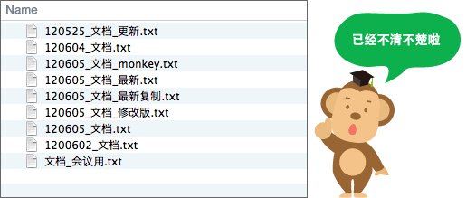
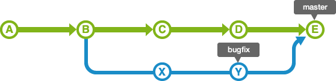
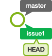
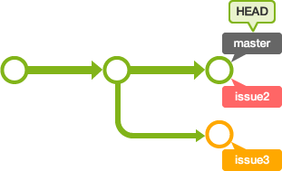
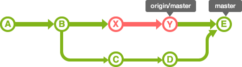

# `Git`

## `Git` 的基础

要把文档还原到编辑前的状态，最简单的方法就是先备份编辑前的文档。比如，在备份的文档名或目录名上添加编辑的日期。但是，每次编辑文档都要事先复制，这样非常麻烦，也很容易出错。



如果像上图那样毫无命名规则的话，就无法区分哪一个文档是最新的了。而且，如果是共享文件的话，应该加上编辑者的名字。还有，那些文档名字没有体现修改内容。

另外，如果两个人同时编辑某个共享文件，先进行编辑的人所做的修改内容会被覆盖。


`Git` 版本管理系统就是为了解决这些问题应运而生的。

`Git` 是一个分布式版本管理系统，是为了更好地管理 `Linux` 内核开发而创立的。

`Git` 可以在任何时间点，把文档的状态作为更新记录保存起来。因此可以把编辑过的文档复原到以前的状态，也可以显示编辑前后的内容差异。

而且，编辑旧文件后，试图覆盖较新的文件的时候（即上传文件到服务器时），系统会发出警告，因此可以避免在无意中覆盖了他人的编辑内容。


数据库是记录文件或目录状态的地方，存储着内容修改的历史记录。在数据库的管理下，把文件和目录修改的历史记录放在对应的目录下。


首先，`Git` 的数据库分为远程数据库和本地数据库的两种:
- 远程数据库: 配有专用的服务器，为了多人共享而建立的数据库。
- 本地数据库: 为了方便用户个人使用，在自己的机器上配置的数据库。

平时用手头上的机器在本地数据库上操作就可以了。如果想要公开在本地数据库中修改的内容，把内容上传到远程数据库就可以了。另外，通过远程数据库还可以取得其他人修改的内容。


创建本地数据库的方法有两种: 一种是创建全新的数据库，另一种是复制远程数据库。


若要把文件或目录的添加和变更保存到数据库，就需要进行提交。

执行提交后，数据库中会生成上次提交的状态与当前状态的差异记录（也被称为 `revision`）。

如下图，提交是以时间顺序排列状态被保存到数据库中的。凭借该提交和最新的文件状态，就可以知道过去的修改记录以及内容。


系统会根据修改的内容计算出没有重复的 `40` 位英文及数字来给提交命名。指定这个命名，就可以在数据库中找到对应的提交。

不同类别的修改（如: `Bug` 修复和功能添加）要尽量分开提交，以方便以后从历史记录里查找特定的修改内容。

执行提交时，系统会要求输入提交信息。请务必输入提交信息，因为在空白的状态下执行提交会失败的。

查看其他人提交的修改内容或自己的历史记录的时候，提交信息是需要用到的重要资料。所以请用心填写修改内容的提交信息，以方便别人理解。

以下是 `Git` 的标准注解:

```
第1行: 提交修改内容的摘要
第2行: 空行
第3行以后: 修改的理由
```

在 `Git` 管理下，实际操作的目录被称为工作树。

在数据库和工作树之间有索引，索引是为了向数据库提交作准备的区域。


`Git` 在执行提交的时候，不是直接将工作树的状态保存到数据库，而是将设置在中间索引区域的状态保存到数据库。因此，要提交文件，首先需要把文件加入到索引区域中。

所以，凭借中间的索引，可以避免工作树中不必要的文件提交，还可以将文件修改内容的一部分加入索引区域并提交。

## 共享数据库

为了将本地数据库的修改记录共享到远程数据库，必须上传本地数据库中存储的修改记录。

为此，需要在 `Git` 执行推送（`Push`）操作。执行 `Push` 之后，本地的修改记录会被上传到远程数据库。所以远程数据库的修改记录就会和本地数据库的修改记录保持同步。


进行克隆（`Clone`）操作就可以复制远程数据库。

执行克隆后，远程数据库的全部内容都会被下载。之后在另一台机器的本地数据库上进行操作。

克隆后的本地数据库的变更履历也会被复制，所以可以像原始的数据库一样进行查看记录或其他操作。

若是共享的远程数据库由多人同时作业，那么作业完毕后所有人都要把修改推送到远程数据库。然后，自己的本地数据库也需要更新其他人推送的变更内容。

进行拉取（`Pull`）操作就可以把远程数据库的内容更新到本地数据库。

进行拉取（`Pull`）操作，就是从远程数据库下载最近的变更日志，并覆盖自己本地数据库的相关内容。

## 整合修改记录


在执行 `pull` 之后，进行下一次 `push` 之前，如果其他人进行了推送内容到远程数据库的话，那么你的 `push` 将被拒绝。


这种情况下，在读取别人 `push` 的变更并进行合并操作之前，你的 `push` 都将被拒绝。这是因为，如果不进行合并就试图覆盖已有的变更记录的话，其他人 `push` 的变更（图中的提交 `C`）就会丢失。

合并的时候，`Git` 会自动合并已有的变更点，不过，也存在不能自动合并的情况。

如果远程数据库和本地数据库的同一个地方都发生了修改的情况下，因为无法自动判断要选用哪一个修改，所以就会发生冲突。

`Git` 会在发生冲突的地方修改文件的内容，如下图。所以我们需要手动修正冲突。


==分割线上方是本地数据库的内容,下方是远程数据库的编辑内容。

如下图所示，修正所有冲突的地方之后，执行提交。


## 分支

在开发软件时，可能有多人同时为同一个软件开发功能或修复 `BUG`，可能存在多个 `Release` 版本，并且需要对各个版本进行维护。

`Git` 的分支功能可以支持同时进行多个功能的开发和版本管理。

分支是为了将修改记录的整体流程分叉保存。分叉后的分支不受其他分支的影响，所以在同一个数据库里可以同时进行多个修改。


分叉的分支可以合并。

下面是使用分支进行作业的图示。

为了不受其他开发人员的影响，可以在主分支上建立自己专用的分支。完成工作后，将自己分支上的修改合并到主分支。因为每一次提交的历史记录都会被保存，所以当发生问题时，定位和修改造成问题的提交就容易多了。


在数据库进行最初的提交后，`Git` 会创建一个名为 `master` 的分支。因此之后的提交，在切换分支之前都会添加到 `master` 分支里。


`Merge` 分支

`Merge` 分支是为了可以随时发布 `release` 而创建的分支，它还能作为 `Topic` 分支的源分支使用。

通常会将 `master` 分支当作 `Merge` 分支使用。

`Topic` 分支

`Topic` 分支是为了开发新功能或修复 `Bug` 等任务而建立的分支。若要同时进行多个的任务，创建多个的 `Topic` 分支。

`Topic` 分支是从稳定的 `Merge` 分支创建的。完成作业后，要把 `Topic` 分支合并回 `Merge` 分支。


若要切换作业的分支，就要进行 `checkout` 操作。进行 `checkout` 时，`git` 会从工作树还原向目标分支提交的修改内容。`checkout` 之后的提交记录将被追加到目标分支。


`HEAD` 指向的是现在使用中的分支的最后一次更新。通常默认指向 `master` 分支的最后一次更新。通过移动 `HEAD`，就可以变更使用的分支。

提交时使用 `~` 和 `^` 就可以指定某个提交的相对位置。最常用的就是相对于 `HEAD` 的位置。`HEAD` 后面加上 `~` 可以指定 `HEAD` 之前的提交记录。合并分支会有多个根节点，可以用 `^` 来指定使用哪个为根节点。


还未提交的修改内容以及新添加的文件，留在索引区域或工作树的情况下切换到其他的分支时，修改内容会从原来的分支移动到目标分支。

但是如果在 `checkout` 的目标分支中相同的文件也有修改，`checkout` 会失败的。这时要么先提交修改内容，要么用 `stash` 暂时保存修改内容后再 `checkout`。

`stash` 是临时保存文件修改内容的区域。`stash` 可以暂时保存工作树和索引里还没提交的修改内容，可以事后再取出暂存的修改，应用到原先的分支或其他的分支上。


完成作业后的 `topic` 分支，最后要合并回 `merge` 分支。合并分支有 `2` 种方法: 使用 `merge` 或 `rebase`。使用这 `2` 种方法，合并后分支的历史记录会有很大的差别。

使用 `merge` 可以合并多个历史记录的流程。

如下图所示，`bugfix` 分支是从 `master` 分支分叉出来的。


合并 `bugfix` 分支到 `master` 分支时，如果 `master` 分支的状态没有被更改过，那么这个合并是非常简单的。`bugfix` 分支的历史记录包含 `master` 分支所有的历史记录，所以通过把 `master` 分支的位置移动到 `bugfix` 的最新分支上，`Git` 就会合并。这样的合并被称为 `fast-forward`（快进）合并。


但是，`master` 分支的历史记录有可能在 `bugfix` 分支分叉出去后有新的更新。这种情况下，要把 `master` 分支的修改内容和 `bugfix` 分支的修改内容汇合起来。


因此，合并两个修改会生成一个提交。这时，`master` 分支的 `HEAD` 会移动到该提交上。



执行合并时，如果设定了 `non fast-forward` 选项，即使在能够 `fast-forward` 合并的情况下也会生成新的提交并合并。


执行 `non fast-forward` 后，分支会维持原状。那么要查明在这个分支里的操作就很容易了。

`rebase` 跟 `merge` 的例子一样，如下图所示，`bugfix` 分支是从 `master` 分支分叉出来的。


如果使用 `rebase` 方法进行分支合并，会出现下图所显示的历史记录。


首先，`rebase bugfix` 分支到 `master` 分支，`bugfix` 分支的历史记录会添加在 `master` 分支的后面。如图所示，历史记录成一条线，相当整洁。

这时移动提交 `X` 和 `Y` 有可能会发生冲突，所以需要修改各自的提交时发生冲突的部分。


`rebase` 之后，`master` 的 `HEAD` 位置不变。因此，要合并 `master` 分支和 `bugfix` 分支，即是将 `master` 的 `HEAD` 移动到 `bugfix` 的 `HEAD` 这里。


`Merge` 和 `rebase` 都是合并历史记录，但是各自的特征不同。

`merge` 保持修改内容的历史记录，但是历史记录会很复杂。

`rebase` 历史记录简单，是在原有提交的基础上将差异内容反映进去。

我们用简单的实例来讲解 `topic` 分支和 `merge` 分支的操作方法。

例如，在开发功能的 `topic` 分支操作途中，需要修改 `bug`。


这时，`merge` 分支还是处于开发功能之前的状态。在这里新建修改错误用的主题分支，就可以从开发功能的作业独立出来，以便开始新的工作。


完成 `bug` 修正的工作后，把分支导入到原本的 `merge` 分支后就可以公开了。


回到原本的分支继续进行开发功能的操作。


但是，如果要继续进行操作，会发现需要之前修正 `bug` 时提交 `X` 的内容。有 `2` 种导入提交 `X` 的内容的方法: 一种是直接 `merge`，另一种是和 `rebase` 导入提交 `X` 的合并分支。

这里我们使用 `rebase` 合并分支的方法。


在导入提交 `X` 的内容的状态下继续进行开发功能。

这样，有效地利用分支的话就可以同时进行不同的作业了。

## 操作分支

首先建立一个新目录，并在里面建立一个空数据库。这里我们创建一个名为 `tutorial` 的目录。

```sh
$ mkdir tutorial
$ cd tutorial
$ git init
Initialized empty Git repository in /home/ubuntu//tutorial/.git/
```

在 `tutorial` 目录创建一个名为 `myfile.txt` 的档案，然后提交。

```sh
$ touch myfile.txt
$ echo "testGit" >> myfile.txt
$ git add myfile.txt
$ git commit -m "first commit"
[master (root-commit) 4d5daaa] first commit
 1 file changed, 1 insertion(+)
 create mode 100644 myfile.txt
```

可以通过 `branch` 命令来创建分支。

```sh
$ git branch <branchname>
```

创建名为 `issue1` 的分支。

```sh
$ git branch issue1
```

不指定参数直接执行 `branch` 命令的话，可以显示分支列表。 前面有 `*` 的就是现在的分支。

```sh
$ git branch
  issue1
* master
```

目前的历史记录是这样的。


若要在新建的 `issue1` 分支进行提交，需要切换到 `issue1` 分支。

要执行 `checkout` 命令以退出分支。

```sh
$ git checkout <branch>
```

切换到 `issue1` 分支。

```sh
$ git checkout issue1
Switched to branch 'issue1'
```

目前的历史记录是这样的。



在 `checkout` 命令指定 `-b` 选项执行，可以创建分支并进行切换。

```sh
$ git checkout -b <branch>
```

在切换到 `issue1` 分支的状态下提交，历史记录会被记录到 `issue1` 分支。在 `myfile.txt` 添加 `add` 命令的说明后再提交。

```sh
$ echo "add 把变更录入到索引中" >> myfile.txt
$ git add myfile.txt
$ git commit -m "添加add的说明"
[issue1 8ad976e] 添加add的说明
 1 file changed, 1 insertion(+)
```

目前的历史记录是这样的。


向 `master` 分支合并 `issue1` 分支的修改。

执行 `merge` 命令以合并分支。

```sh
$ git merge <commit>
```

该命令将指定分支导入到 `HEAD` 指定的分支。先切换 `master` 分支，然后把 `issue1` 分支导入到 `master` 分支。

```sh
$ git checkout master
Switched to branch 'master'
```

打开 `myfile.txt` 档案以确认内容，然后提交。

已经在 `issue1` 分支进行了编辑，但是 `master` 分支的 `myfile.txt` 的内容没有更改。

```sh
$ cat myfile.txt
testGit
$ git merge issue1
Updating 4d5daaa..8ad976e
Fast-forward
 myfile.txt | 1 +
 1 file changed, 1 insertion(+)
```
`master` 分支指向的提交移动到和 `issue1` 同样的位置。这个是 `fast-forward`（快进）合并。


打开 `myfile.txt` 档案，确认内容。

```sh
$ cat myfile.txt

testGit
add 把变更录入到索引中
```

已添加 `add 把变更录入到索引中`。

既然 `issue1` 分支的内容已经顺利地合并到 `master` 分支了，现在可以将其删除了。

在 `branch` 命令指定 `-d` 选项执行，以删除分支。

```sh
$ git branch -d <branchname>
```

执行以下的命令以删除 `issue1` 分支。

```sh
$ git branch -d issue1
Deleted branch issue1 (was 8ad976e).
```

`issue1` 分支被删除了。用 `branch` 命令来确认分支是否已被删除。

```sh
$ git branch
* master
```


接下来，创建 `2` 个分支来尝试并行操作。

首先创建 `issue2` 分支和 `issue3` 分支，并切换到 `issue2` 分支。

```sh
$ git branch issue2
$ git branch issue3
$ git checkout issue2
Switched to branch 'issue2'
$ git branch
* issue2
  issue3
  master
```


在 `issue2` 分支的 `myfile.txt` 添加 `commit` 命令的说明后提交。

```sh
$ echo "commit 记录索引的状态" >> myfile.txt
$ git add myfile.txt
$ git commit -m "添加commit的说明"
[issue2 5c3910f] 添加commit的说明
 1 file changed, 1 insertion(+)
```


接着，切换到 `issue3` 分支。

```sh
$ git checkout issue3
Switched to branch 'issue3'
```

打开 `myfile.txt` 档案。由于在 `issue2` 分支添加了 `commit` 命令的说明，所以 `issue3` 分支的 `myfile.txt` 里只有 `add` 命令的说明。

添加 `pull` 命令的说明后提交。


```sh
$ echo "pull 取得远端数据库的内容" >> myfile.txt
$ git add myfile.txt
$ git commit -m "添加pull的说明"
[issue3 5dfc5f4] 添加pull的说明
 1 file changed, 1 insertion(+)
```


这样，添加 `commit` 的说明的操作，和添加 `pull` 的说明的操作就并行进行了。


把 `issue2` 分支和 `issue3` 分支的修改合并到 `master`。

切换 `master` 分支后，与 `issue2` 分支合并。

```sh
$ git checkout master
Switched to branch 'master'
$ git merge issue2
Updating 8ad976e..5c3910f
Fast-forward
 myfile.txt | 1 +
 1 file changed, 1 insertion(+)
```

执行 `fast-forward`（快进）合并。


接着合并 `issue3` 分支。

```sh
$ git merge issue3
Auto-merging myfile.txt
CONFLICT (content): Merge conflict in myfile.txt
Automatic merge failed; fix conflicts and then commit the result.
```

自动合并失败。由于在同一行进行了修改，所以产生了冲突。这时 `myfile.txt` 的内容如下:

```sh
cat myfile.txt 
testGit
add 把变更录入到索引中
<<<<<<< HEAD
commit 记录索引的状态
=======
pull 取得远端数据库的内容
>>>>>>> issue3
```

在发生冲突的地方，`Git` 生成了内容的差异。使用 `vim` 做以下修改:

```
testGit
add 把变更录入到索引中
commit 记录索引的状态
pull 取得远端数据库的内容
```

修改冲突的部分，重新提交。

```sh
$ git add myfile.txt
$ git commit -m "合并issue3分支"
```

历史记录如下图所示。因为在这次合并中修改了冲突部分，所以会重新创建合并修改的提交记录。这样，`master` 的 `HEAD` 就移动到这里了。这种合并不是 `fast-forward` 合并，而是 `non fast-forward` 合并。


合并 `issue3` 分支的时候，使用 `rebase` 可以使提交的历史记录显得更简洁。

现在暂时取消刚才的合并。

```sh
$ git reset --hard HEAD~
HEAD is now at 5c3910f 添加commit的说明
```



切换到 `issue3` 分支后，对 `master` 执行 `rebase`。


```sh
$ git checkout issue3
Switched to branch 'issue3'
$ git rebase master
First, rewinding head to replay your work on top of it...
Applying: 添加pull的说明
Using index info to reconstruct a base tree...
M       myfile.txt
Falling back to patching base and 3-way merge...
Auto-merging myfile.txt
CONFLICT (content): Merge conflict in myfile.txt
error: Failed to merge in the changes.
Patch failed at 0001 添加pull的说明
hint: Use 'git am --show-current-patch' to see the failed patch
Resolve all conflicts manually, mark them as resolved with
"git add/rm <conflicted_files>", then run "git rebase --continue".
You can instead skip this commit: run "git rebase --skip".
To abort and get back to the state before "git rebase", run "git rebase --abort".
```

和 `merge` 时的操作相同，修改在 `myfile.txt` 发生冲突的部分。

`rebase` 的时候，修改冲突后的提交不是使用 `commit` 命令，而是执行 `rebase` 命令指定 `--continue` 选项。若要取消 `rebase`，指定 `--abort`选项。

```sh
$ git add myfile.txt
$ git rebase --continue
Applying: 添加pull的说明
```


这样，在 `master` 分支的 `issue3` 分支就可以 `fast-forward` 合并了。切换到 `master` 分支后执行合并。

```sh
$ git checkout master
Switched to branch 'master'
$ git merge issue3
Updating 5c3910f..31d8009
Fast-forward
 myfile.txt | 1 +
 1 file changed, 1 insertion(+)
```

`myfile.txt` 的最终内容和 `merge` 是一样的，但是历史记录如下。


## 远端数据库

执行 `pull` 可以取得远程数据库的历史记录。

首先确认更新的本地数据库分支没有任何的更改。


这时只执行 `fast-forward` 合并。图中的 `master` 是本地数据库的 `master` 分支，`origin/master` 是远程数据库的 `origin` 的 `master` 分支。


如果本地数据库的 `master` 分支有新的历史记录，就需要合并双方的修改。


执行 `pull` 就可以进行合并。这时，如果没有冲突的修改，就会自动创建合并提交。如果发生冲突的话，要先解决冲突，再手动提交。


执行pull，远程数据库的内容就会自动合并。但是，有时只是想确认本地数据库的内容而不想合并。这种情况下使用 `fetch`。

执行 `fetch` 就可以取得远程数据库的最新历史记录。取得的提交会导入到没有名字的分支，这个分支可以从名为 `FETCH_HEAD` 的退出。

例如，在本地数据库和远程数据库的 `origin`，如果在从 `B` 进行提交的状态下执行 `fetch`，就会形成如下图所示的历史记录。


在这个状态下，若要把远程数据库的内容合并到本地数据库，可以合并 `FETCH_HEAD`，或者重新执行 `pull`。



合并后，历史记录会和 `pull` 相同。实际上 `pull` 的内容是 `fetch + merge` 组成的。

从本地数据库 `push` 到远程数据库时，要 `fast-forward` 合并 `push` 的分支。如果发生冲突，`push` 会被拒绝的。

若要共享在本地数据库创建的分支，需要明确的 `push`。因此，没有执行 `push` 就不会给远程数据库带来影响，因而可以自由的创建自己的分支。


基本上，远程数据库共享的提交是不能修改的。如果修改的话，跟远程数据库同步的其他数据库的历史记录会变得很奇怪的。

## 标签

标签是为了更方便地参考提交而给它标上易懂的名称。

`Git` 可以使用 `2` 种标签: 轻标签和注解标签。打上的标签是固定的，不能像分支那样可以移动位置。

- 轻标签
  - 添加名称
- 注解标签
  - 添加名称
  - 添加注解
  - 添加签名

一般情况下，发布标签是采用注解标签来添加注解或签名的。轻标签是为了在本地暂时使用或一次性使用。


## 操作标签

首先建立一个新目录，并在里面建立一个空数据库。创建一个名为 `tutorial` 的目录。

```sh
$ mkdir tutorial
$ cd tutorial
$ git init
Initialized empty Git repository in /home/ubuntu//tutorial/.git/
```

在 `tutorial` 目录创建一个名为 `myfile.txt` 的档案，然后提交。

```sh
$ touch myfile.txt
$ echo "testGit" >> myfile.txt
$ git add myfile.txt
$ git commit -m "first commit"
[master (root-commit) dccd8e1] first commit
 1 file changed, 1 insertion(+)
 create mode 100644 myfile.txt
```

目前的历史记录是这样的。


### 添加轻标签

使用 `tag` 命令来添加标签，在 `<tagname>` 执行标签的名称。

```sh
$ git tag <tagname>
```

在 `HEAD` 指向的提交里添加名为 `apple` 的标签。

```sh
$ git tag apple
```

如果没有使用参数而执行 `tag`，可以显示标签列表。

```sh
$ git tag
apple
```

如果在 `log` 命令添加 `--decorate` 选项执行，可以显示包含标签资料的历史记录。

```sh
$ git log --decorate
commit dccd8e18154db5f83fc8962d6295332d4f9a56e0 (HEAD -> master, tag: apple)
Author: yourname <yourname@yourmail.com>
Date:   Fri Jul 15 18:57:03 2022 +0800

    first commit
```


### 添加注解标签

若要添加注解标签，可以在 `tag` 命令指定 `-a` 选项执行。执行后会启动编辑区，请输入注解，也可以指定 `-m` 选项来添加注解。

```sh
$ git tag -a <tagname>
```

在 `HEAD` 指向的提交里添加名为 `banana` 的标签。

```sh
$ git tag -am apple banana
```


如果在 `tag` 命令指定 `-n` 选项执行，可以显示标签的列表和注解。

```sh
$ git tag -n
apple           first commit
banana          apple
```

若要删除标签，在 `tag` 命令指定 `-d` 选项执行。

```sh
$ git tag -d <tagname>
```


# `Git` 总结与补充

## 配置

### 设置用户信息

```sh
$ git config --global user.name "XXX" # 设置用户名
$ git config --global user.email "XXXX" # 设置邮箱
```

### 查看配置信息

```sh
$ git git config --global user.name
$ git config --global user.email
```

### 创建本地仓库

```sh
$ git init
```

### 查看修改的状态

```sh
$ git status
```

### 添加工作区到暂存区

```sh
$ git add file.txt # 添加单个文件
$ git add . # 将所有修改加入暂存区
```

### 提交暂存区到本地仓库

```sh
$ git commit -m "XXX update"
```

### 查看提交日志

```
$ git log [option]
```

`—all` 显示所有分支
`—pretty=oneline` 将提交信息显示为一行
`—abbrev-commit` 使得输出的 `commitId` 更简短
`—graph` 以图的形式显示

### 版本回退

```sh
$ git reset --hard commitID # commitID 可以使用 git log 指令查看
```

### 添加文件至忽略列表

一般我们总会有些文件无需纳入 `Git` 的管理，也不希望它们总出现在未跟踪文件列表。 通常都是些自动生成的文件，比如日志文件，或者编译过程中创建的临时文件等。在这种情况下，我们可以在工作目录中创建一个名为 `.gitignore` 的文件（文件名称固定），列出要忽略的文件模式。

### 查看本地分支

```sh
$ git branch
```

### 创建本地分支

```sh
$ git branch 分支名
```

### 切换分支

```sh
$ git checkout 分支名
```

### 切换到一个不存在的分支（创建并切换）

```sh
$ git checkout -b 分支名
```

### 合并分支

```sh
$ git merge 分支名
```

### 删除分支

不能删除当前分支，只能删除其他分支

```sh
$ git branch -d 分支名 # 删除分支时，需要做各种检查
$ git branch -D 分支名 # 不做任何检查，强制删除
```

### 解决冲突

当两个分支上对文件的修改可能会存在冲突，例如同时修改了同一个文件的同一行，这时就需要手动解决冲突，解决冲突步骤如下:
- 处理文件中冲突的地方
- 将解决完冲突的文件加入暂存区
- 提交到仓库

### 添加远程仓库

```sh
$ git remote add <远端名称> <仓库地址>
```

远端名称: 默认是 `origin`，取决于远端服务器设置
仓库地址: 从远端服务器获取此 `url`

### 查看远程仓库

```sh
$ git remote
```

### 推送到远程仓库

```sh
$ git push [-f] [--set-upstream] [远端名称] [本地分支名][:远端分支名]
```

+ `-f` 表示强制推送，**一般在公司内没有这个的使用权限**，否则容易冲掉远程仓库的所有代码
+ `--set-upstream` 推送到远端的同时，建立起和远端分支的关联关系。用于第一次推送时
+ 如果当前分支已经和远端分支关联，则可以省略分支名和远端名
+ `git push` 将 `master` 分支推送到已关联的远端分支

### 本地分支与远程分支的关联关系

```sh
$ git branch -vv
```

### 从远程仓库克隆

```sh
$ git clone <仓库地址> [本地目录]
```

本地目录可以省略，会自动生成一个目录。

### 从远程仓库中抓取和拉取

远程分支和本地的分支一样，我们可以进行 `merge` 操作，只是需要先把远端仓库里的更新都下载到本地，再进行操作。

抓取指令就是将仓库里的更新都抓取到本地，不会进行合并，如果不指定远端名称和分支名，则抓取所有分支。

```sh
$ git fetch [remote name] [branch name]
```

拉取指令就是将远端仓库的修改拉到本地并自动进行合并，等同于 `fetch+merge`，如果不指定远端名称和分支名，则抓取所有并更新当前分支。

```sh
$ git pull [remote name] [branch name]
```

### 解决合并冲突

在一段时间，`A`、`B` 用户修改了同一个文件，且修改了同一行位置的代码，此时会发生合并冲突。

`A` 用户在本地修改代码后优先推送到远程仓库，此时 `B` 用户在本地修订代码，提交到本地仓库后，也需要推送到远程仓库，此时 `B` 用户晚于 `A` 用户，故需要先拉取远程仓库的提交，经过合并后才能推送到远端分支。

在 `B` 用户拉取代码时，因为 `A`、`B` 用户同一段时间修改了同一个文件的相同位置代码，故会发生合并冲突。

远程分支也是分支，所以合并时冲突的解决方式也和解决本地分支冲突相同相同。


### `HEAD` 的理解

`HEAD` 指向当前所在的分支，类似一个活动的指针，表示一个「引用」。

`HEAD` 既可以指向「当前分支」的最新 `commit`，也可以指向历史中的某一次 `commit` （「分离头指针」的情况）。归根结底，`HEAD` 指向的就是某个提交点。

当我们做分支切换时，`HEAD` 会跟着切换到对应分支。